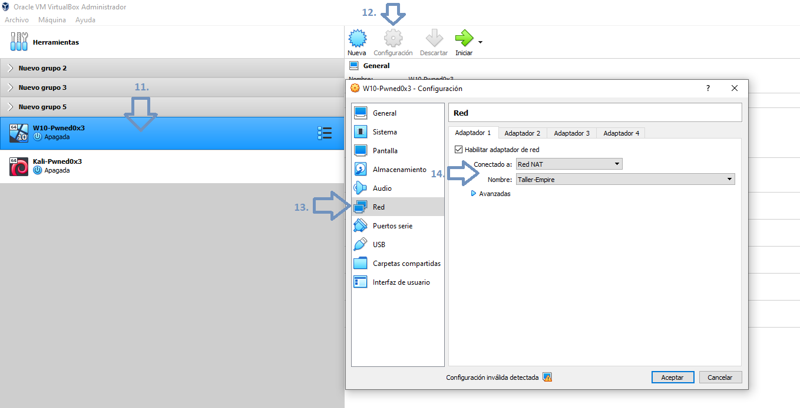

# Lab-Setup Empire Pwnedcr 0x3

## Materiales:
* VirtualBox
* VM Kali / VM Parrot
* VM W10 

## Instrucciones de configuración del Laboratorio:

### 1- Importar la VM W10 a Virtualbox.

  
  

  
  

  

### 2-Crear Red Nat Interna para aislar el laboratorio.

### 3- Agregar las VM a la Red Nat Interna

